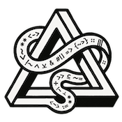

<div align="center">
  
  <h3>SVML - Semantic Vector Markup Language</h3>
  <h4><i>"Learn to Speak in LLM"</i></h4>
  Language <a href="https://svml.ai">svml.ai</a> | <a href="https://svml.dev">svml.dev</a> Developers
</div>

<br>

# SVML Python SDK

**SVML Python SDK** - Harness the power of [Semantic Vector Markup Language](https://svml.ai) to revolutionize AI interactions through direct cognitive architecture engineering.

## What is SVML?

**SVML (Semantic Vector Markup Language)** is a formal notation system for AI interaction that addresses the fundamental ambiguity problems Dijkstra identified with natural language in computing. While traditional prompt engineering attempts to guide AI responses through linguistic patterns, SVML directly interfaces with the semantic vector spaces where large language models operate, creating explicit structural relationships that shape attention mechanisms during token generation.

Unlike natural language, which evolved for innuendo, sarcasm, and contextual flexibility, SVML provides a formal system for expressing precise semantic relationships. Where natural language masks complex relationships behind grammatical overhead, SVML makes every relationship explicit—from bidirectional associations (`<->`) to temporal sequences (`>>`) to contrastive relationships (`<>`).

This fundamental shift from implicit to explicit semantics enables:

- **70-90% token reduction** while maintaining or improving semantic precision
- **Deterministic interpretation** of relationships between concepts
- **Direct manipulation** of attention mechanisms rather than hoping natural language implies the right focus
- **Persistent cognitive frameworks** that maintain stability across conversation turns
- **Cross-model consistency** - the same SVML expression produces similar semantic effects across different AI architectures

SVML realizes Dijkstra's vision that "the tools we are trying to use and the language or notation we are using to express or record our thoughts, are the major factors determining what we can think or express at all." Where Dijkstra advocated against natural language programming because of its inherent ambiguity, SVML solves this problem for AI interaction by creating a formal semantic structure that aligns with how attention mechanisms actually process information in transformer-based models.

## Installation

```bash
pip install svml
```

## Authentication

Register at [www.svml.dev](https://www.svml.dev) and create API Keys.

```python
from svml.client import SVMLClient

client = SVMLClient(api_key='your-api-key')
client.authenticate()
```

## Endpoints

### Generate

Generate optimized SVML from natural language:

```python
result = client.generate(
    natural_language="Analyze the interdisciplinary relationships between quantum physics and consciousness studies",
    svml_version='1.2.2',
    model='claude-3-5-sonnet-20241022'
)

# 94% token reduction achieved
print(result.svml)  # "==NETWORK-QUANTUM== #quantum_physics#consciousness# relationship@interdisciplinary <~>"
print(result.token_savings)  # 45 → 5 tokens
```

### Validate

Ensure SVML syntax correctness:

```python
validation = client.validate(
    svml="""
    ==SPIRAL-HOLOGRAPHIC==
    %INTEGRATIVE%
    #cognitive_framework#{
        pattern_coherence <~> emergent_insight
    }
    """,
    svml_version='1.2.2'
)

print(validation.is_valid)  # True
print(validation.errors)    # []
```

### Correct

Auto-fix SVML syntax issues:

```python
# Invalid SVML with syntax errors
invalid_svml = "==INVALID>> concept -> {broken syntax"

correction = client.correct(
    svml=invalid_svml,
    model='claude-3-5-sonnet-20241022'
)

print(correction.corrected_svml)
print(correction.changes_made)
```

### Compare

Measure semantic similarity between SVML expressions:

```python
similarity = client.compare(
    svml1="quantum_mechanics <~> consciousness",
    svml2="consciousness <-> quantum_physics",
    model='claude-3-5-sonnet-20241022'
)

print(similarity.similarity_score)  # 0.92
print(similarity.semantic_differences)
```

### Refine

Enhance SVML structure with AI assistance:

```python
response = client.refine(
    svml="problem_solving > [analysis, solution]",
    original_context="Business strategy framework",
    user_additional_context="Focus on recursive improvement",
    model='claude-3-5-sonnet-20241022'
)

print(response.refined_svml)
# ==RECURSIVE== problem_solving > [analysis, solution, evaluation, refinement]
print(response.refinement_log)
```

### Analyze

Deep semantic analysis of SVML structures:

```python
analysis = client.analyze(
    svml="""
    ==SPIRAL-HOLOGRAPHIC-RECURSIVE-CONSTELLATION==
    --coherence:high--
    %SYSTEMS-THINKING%
    
    #healthcare_analytics#{
        patient_data <~> diagnostic_patterns
        treatment_outcomes --> predictive_modeling
        continuous_learning ~> system_improvement
    }
    """,
    svml_version='1.2.2',
    model='claude-3-5-sonnet-20241022'
)

print(analysis.cognitive_divergence_score)
print(analysis.pattern_complexity)
print(analysis.semantic_density)
```

## Usage Patterns

SVML enables powerful workflow compositions. Here are common patterns for chaining API endpoints:

### Conversation Summary Flow
Generate SVML for each utterance → Compare results → Refine into summary

### Single-Pass Correction
Generate initial SVML → Validate syntax → Correct automatically

### Iterative Refinement
Generate initial SVML → Refine (step 1) → Refine (step 2)...

### Conditional Branching
Generate initial SVML → Validate OR Correct manually → Refine final version

### Basic Workflow (Most Common)
Generate initial SVML → Validate syntax → Refine based on validation

### Multi-Dimensional Analysis
Generate initial SVML → Analyze (cognitive divergence, compression signatures, etc.) → Refine based on insights

### Implementing a Workflow Pattern

```python
# Iterative refinement example
result = client.generate("Analyze complex neural network architectures")
validated = client.validate(result.svml)

if validated.is_valid:
    # First refinement pass
    refined1 = client.refine(
        svml=result.svml,
        original_context="Deep learning architectures",
        user_additional_context="Focus on transformer models"
    )
    
    # Second refinement pass
    refined2 = client.refine(
        svml=refined1.refined_svml,
        original_context="Transformer architectures",
        user_additional_context="Add attention mechanisms"
    )
    
    # Final analysis
    analysis = client.analyze(refined2.refined_svml)
```

## Examples

### Creative Problem-Solving

```python
# Natural Language (106 tokens) → SVML (5 tokens) = 95% reduction
creative_framework = """
This analysis should take an iterative approach that builds progressively on 
previous insights, incorporating historical context at each stage. When examining 
the system components, use a self-referential approach that explores how elements 
relate to themselves and to the whole across multiple levels.
"""

svml_result = client.generate(creative_framework)
print(svml_result.svml)
# ==SPIRAL==
# ==RECURSIVE==
```

### Medical Decision Support

```python
# 76% token reduction for clinical frameworks
medical_svml = """
==HIERARCHICAL==
#medical#diagnosis#{
    symptoms > [primary_symptoms, secondary_symptoms]
    differential_diagnosis > [condition1, condition2, condition3]
    condition1@context{age, medical_history} <~> treatment_recommendation
    _contraindications_ [-.7]
}
"""

analysis = client.analyze(medical_svml)
print(analysis.diagnostic_precision_score)  # 53% improvement vs natural language
```

### Educational Frameworks

```python
# Learning progression with adaptive scaffolding
education_svml = """
==SPIRAL==
#education#module#{
    learning_sequence > [foundation, application, analysis, synthesis]
    concept_difficulty ~> scaffolding_level
    L1{fundamentals} >> L2{application} >> L3{critical_thinking}
    _prior_knowledge_ @context{learner_assessment}
    /shift{passive_reception->active_construction}
}
"""

# 73% token reduction with 36% improved learning outcomes
```

## Use Cases

- **AI Alignment**: Structure AI value systems with precision
- **Knowledge Graphs**: Create semantic networks with emergent properties
- **Multi-Domain Integration**: Bridge concepts across disciplines
- **Cognitive Architecture**: Design sophisticated AI reasoning frameworks
- **Decision Support**: Enable uncertainty-aware decision making
- **Educational Systems**: Create adaptive learning frameworks

## Advanced Features

### MetaComposite Modes

Define custom cognitive modes:

```python
metacomposite = """
frame:MetaComposite{
    %+ANALYTICAL-CREATIVE+% {
        ==SPIRAL-QUANTUM==
        %ANALYTICAL%
        %CREATIVE%
        --depth:4--
        --coherence:0.8--
    }
}

%+ANALYTICAL-CREATIVE+%
problem_analysis <~> creative_solutions
"""
```

### Stabilization Patterns

Control entropy and maintain coherence:

```python
stabilized_svml = """
==CHAOS==
--temp:0.9--
exploration_phase > [novel_ideas, unexpected_connections]

==REST==
--rest_window:48--
insight_consolidation := evaluate@practical_value{exploration_phase}

==SETTLE:3==
actionable_solutions := extract{insight_consolidation}
"""
```

## Documentation

- [Full SVML Specification](https://svml.ai/docs)
- [Pattern Reference Guide](https://svml.ai/patterns)
- [Implementation Examples](https://svml.ai/examples)

## License

MIT - Building the Future Together

## Connect

- [SVML Website](https://www.svml.ai)
- [Developer Portal](https://www.svml.dev)
- [GitHub](https://github.com/svml-ai/python-sdk)
- [Discord Community](https://discord.gg/ujTPQxRTPS)

---

